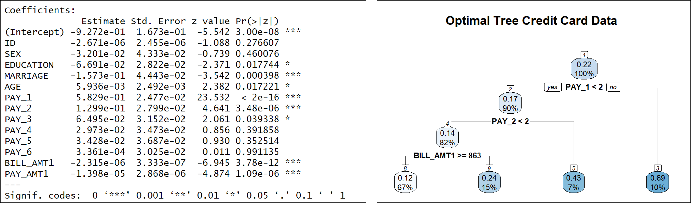

# Portfolio Projects

### Skills:

---

### Project 1: Business Analysis using Microsoft SQL Server, Tableau and Microsoft Power BI

Employed SQL to perform data cleaning and calculations of crucial sales Key Performance Indicators. Subsequently, I utilised Tableau and Power BI to visualisat the derived insigts offering a clear and dynamic representation of the shops'business performance.

 

Visualisation using Tableau

Visualisation using Microsoft Power BI

---
### Project 2: Created a WordCloud and conducted Sentiment Analysis on Singapore Budget 2023 speech using Text Mining in R programming

Used R programming to create insightful WordCloud which visually encapsulates the most prominent themes and priorities outlined in the Budget 2023 speech. Additionally, I employed Sentiment Analysis to gauge how the public is likely to percieve and react to the budgetary announcements.
 

 

---
### Project 3: Assesed and Predicted potential risk of default by credit card clients using Decision Trees (CART) and Logistic Regression

 Applied the Decision Trees using CART (Classification and Regression Trees) Model and Logistic Regression Model to perform an extensive analysis of credit card default risk. Additionaly, I conducted a comparative assessment of both models to ascertain their respective accuracies in predicting default occurrences. This rigorous evaluation aimed to discern the superior predictive performance within the context of credit card default risk

 

---

