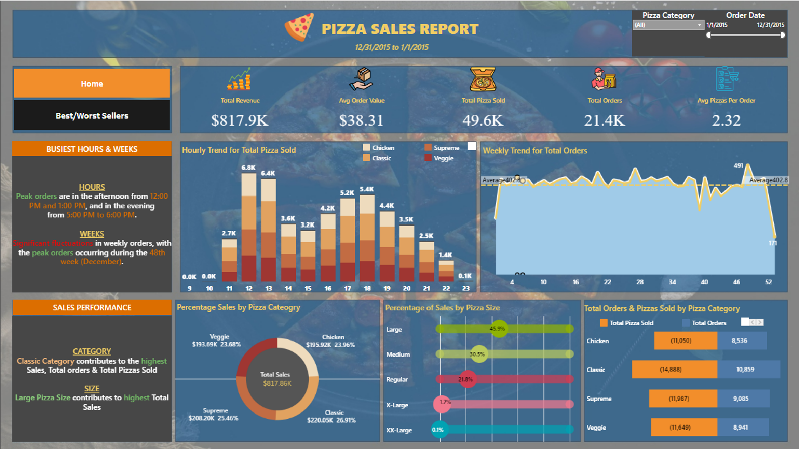
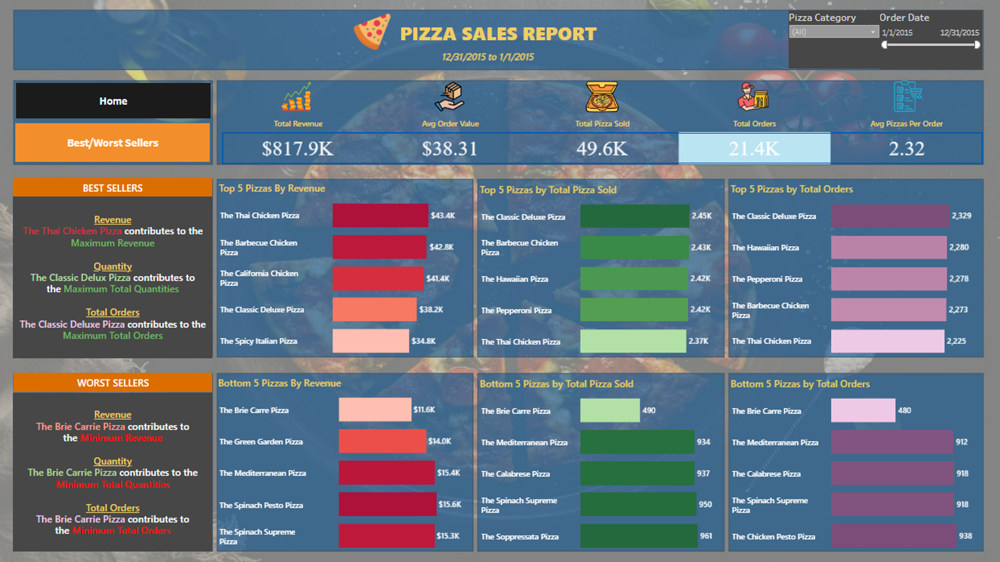
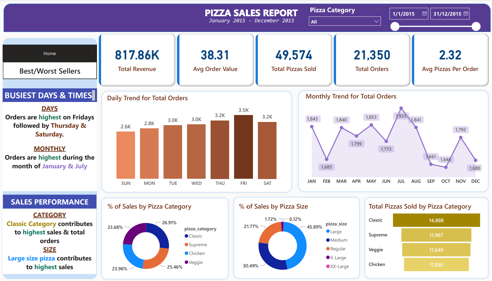
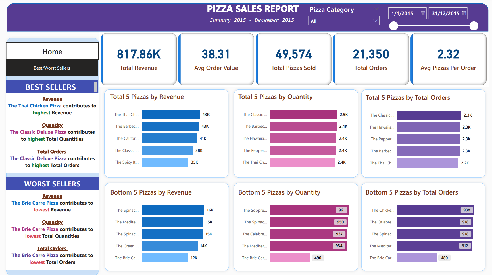
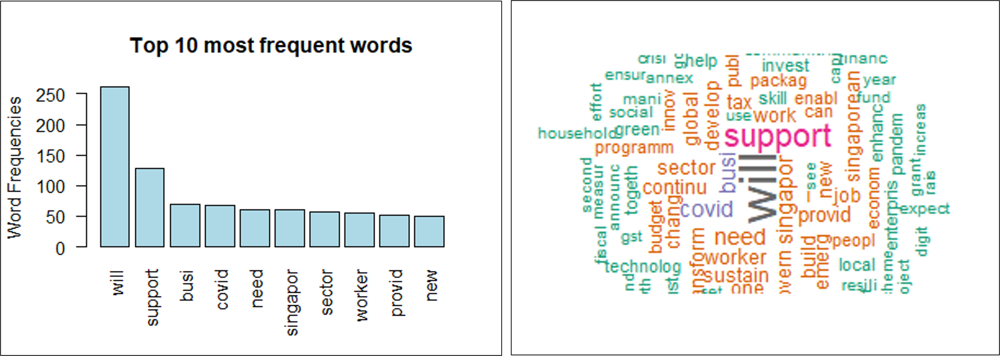
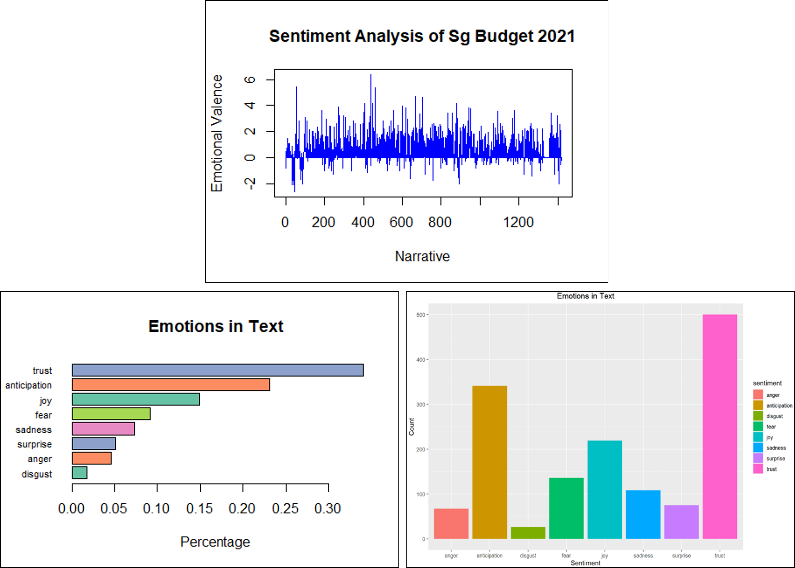
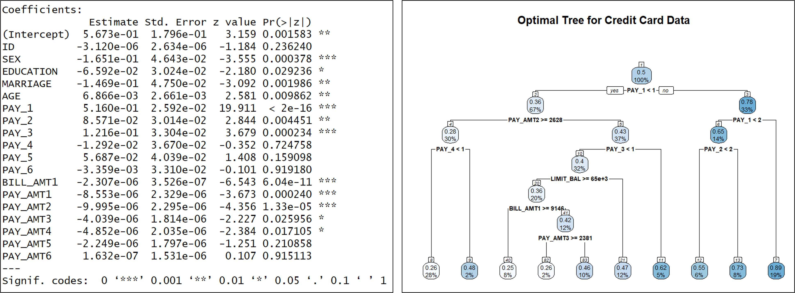

# Portfolio Projects

### Skills:

### Certification

---

### Project 1: Business Analysis using Microsoft SQL Server, Tableau and Microsoft Power BI

 
### Business Problem Scenario:
  + A Pizza shop is facing a business challenge in understanding customer preferences and optimizing their menu. They would like to utilize data analytics to improve overall business performance and identify their best-selling pizza to focus on marketing and promotion efforts.

### Solution Plan:
  + Employed SQL to perform data cleaning and extraction of crucial sales Key Performance Indicators(KPIs). Subsequently, I utilised Tableau and Power BI to visualisat the derived insigts offering a clear and dynamic representation of the shops'business performance. Lastly, I formulated recommendations on how to improve business performance of the Pizza Shop.

    <h3><strong>Visualisation using Tableau</strong></h3>

 

    <h3><strong>Visualisation using Microsoft Power BI</strong></h3>

---
### Project 2: Generated a WordCloud and conducted Sentiment Analysis on Singapore Budget 2023 speech using Text Mining in R programming

### Background:
  + I was interested in how to leverage data anlytics to get a brief understanding and overview of the main subject of focus without haveing to dive too deep into extremely long texts. Hence I decicded to explore the use of R programming to perform web scraping and data cleaning.
  + I created an insightful WordCloud which visually encapsulates the most prominent themes and priorities outlined in the Budget 2021 speech. Furthermore, I employed Sentiment Analysis to gauge how the public is likely to percieve and react to the budgetary announcements.

### Findings:
  + From the 10 most frequent words, I can infer the key message from the budget is that there “Will” be “Support” for“Business” and “Worker” because of “Covid”. Further investigation through additional literature research indicates that 2021 was a period whereby the COVID-19 cases  in Singapore were high and many businesses were facing challenges due to measures such as cicuit breaker and dining restrictions imposed by the government.
  + From the sentimental analysis, the valence of the emotion contained in the speech is generally positive throughout.
  + Overall, the budget speech encompasses sentiments primarily linked to themes of Trust, Anticipation, and Joy.

 

---
### Project 3: Assesed and Predicted potential risk of default by credit card clients using Decision Trees (CART) and Logistic Regression

### Business Problem Scenario:
  + In an increasingly competitive market, banks are under pressure to attract and retain customers by offering credit card products with attractive terms and rewards. However, the allure of credit comes with inherent risks, particularly in times of economic volatility or changing consumer behavior. The ability to effectively assess and manage default risks is crucial for maintaining the bank's financial stability and competitive edge.

### Solution Plan:
  + Applied the Decision Trees using CART (Classification and Regression Trees) Model and Logistic Regression Model to perform an extensive analysis of credit card default risk.
  + Additionaly, I conducted a comparative assessment of both models to ascertain their respective accuracies in predicting default occurrences. This rigorous evaluation aimed to discern the superior predictive performance within the context of credit card default risk

---
### Project 4: Forecasting Heart Disease in Python using machine learning

### Business Problem Scenario:

